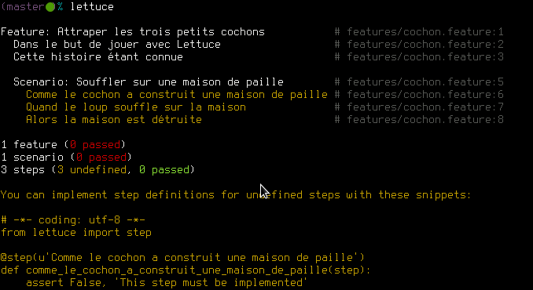
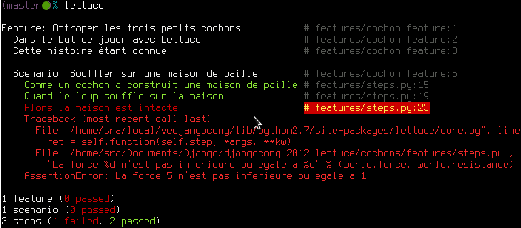
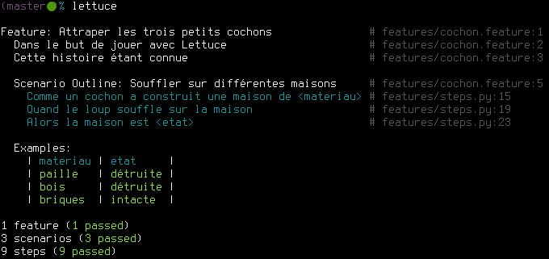

=======
Lettuce
=======

Racontez-moi des histoires sans me raconter de salades !

DjangoCong 2012

Presenter Notes
===============

Nous allons ensemble raconter des histoires avec Lettuce, des histoires vraies,
ou du moins c'est ce que nous allons essayer de vérifier.

----

Qui suis-je ?
=============

Stéphane Raimbault

@work Djangonaute pour Polyconseil sur le projet Autolib’

@home Open source fan (Linux, GNOME, libmodbus)

Presenter Notes
===============

Je m'appelle Stéphane Raimbault, je suis Djangonaute depuis quelques années et
je travaille actuellement sur le projet Autolib’ pour Polyconseil.

----

Lettuce en quelques mots
========================

Lettuce est outil de *Behavior Driven Development* (BDD)

Une fois les tests unitaires écrits, le BDD permet d'écrire les tests fonctionnels.

`Ruby` avait `Cucumber`, `Python` a désormais `Lettuce` !

Presenter Notes
===============

Lettuce est outil de BDD. Une fois les tests unitaires écrits, Lettuce vous
permet d'écrire des test fonctionnels.

Lettuce trouve son inspiration dans le monde Ruby avec Cucumber.

----

Avant de passer à table
=======================

Les `features` expriment les intentions du test dans un langage naturel::

  Feature: Attraper les trois petits cochons
      Dans le but de jouer avec Lettuce
      Cette histoire étant connue

  Scenario: Souffler sur une maison de paille
      Comme le cochon a construit une maison de paille
      Quand le loup souffle sur la maison
      Alors la maison est détruite

Presenter Notes
===============

Avant de passer à table un peu de terminologie. Les features décrivent
l'intention du test en quelques phrases et contiennent des scénaris. Chaque
étape d'un scénario sera ensuite associé à du code Python.
Une fois notre premier scénario écris, nous pouvons lancer Lettuce.

----

Lettuce vous tient la main
==========================

Presenter Notes
===============

Lettuce tente de le dérouler sans y parvenir, et pour cause, le code Python
n'est pas encore écrit. Toutefois, pour nous aider, Lettuce nous donne un
squelette, que nous allons compléter.

----

Et un peu de code
=================

.. code-block:: python

    @step('cochon a construit une maison de (paille|bois|briques)')
    def get_house_material(step, material):
        world.resistance = MATERIAL_RESISTANCES[material]

    @step('le loup souffle sur la maison')
    def blow_on_house(step):
        world.force = WOLF_FORCE

    @step(u"la maison est (détruite|intacte)")
    def check_house_state(step, state):
        if state == u"détruite":
            # The wolf force is greater than the house resistance
            assert world.force > world.resistance, \
                "La force %d n'est pas superieure a %d" % (
                world.force, world.resistance)
        else:
            assert world.force <= world.resistance, \
                "La force %d n'est pas inférieure ou égale %d" % (
                world.force, world.resistance)

Presenter Notes
===============

Chaque phrase est associée à une fonction par le biais d'un décorateur contenant
ne expression régulière. C'est donc cette expression régulière qui va faire la
jonction, l'extraction des arguments et la fonction
Python.

----

Lançons les tests
=================

Plus convivial qu'un ``AssertionError: True is not false`` :)

Presenter Notes
===============

Pour vous montrer la qualité du contexte fourni par Lettuce, voici un exemple de
test qui échoue. Les 2 premières étapes ont réussies, les dernières ont échouées
car la maison de paille n'est pas intacte.

Ce qui facilite nettement la maintenabilité des tests.

----

Écrivez des variantes
=====================

En jouant sur les expressions régulières, il est facile d'écrire la variante
suivante ::

  Scenario: Souffler sur une maison de briques
      Comme un cochon a construit une maison de briques
      Quand le loup souffle sur la maison
      Alors la maison est intacte

Rappel de la première *step* associée :

.. code-block:: python

    @step('cochon a construit une maison de (paille|bois|briques)')
    def get_house_material(step, material):
        world.resistance = MATERIAL_RESISTANCES[material]

Presenter Notes
===============

Quand le scénarion est bon, il est tentant d'en écrire des variantes. Utilisons
cette fois ci une maison pas de paille mais de briques. Il suffit de nous
assurer que l'expression régulière sera capable de gérer cet argument.

----

L'usine à variantes
===================

Quand l'histoire est la même mais que le contexte change ::

  Scenario Outline: Souffler sur différentes maisons
    Comme un cochon a construit une maison de <materiau>
    Quand le loup souffle sur la maison
    Alors la maison est <etat>

    Examples:
    | materiau | etat     |
    | paille   | détruite |
    | bois     | détruite |
    | briques  | intacte  |

Presenter Notes
===============

Pour disposer d'une forme compacte de variantes à nos scénaris. Lettuce nous
permet de les exprimer sous forme de tableaux. Les variables deviennent des
placeholders dans les étapes. Comme ici avec <materiau> et <etat>. Lettuce va
ensuite dérouler un scénario complet pour chaque ligne du tableau.

----

et sa production de résultats
=============================

Presenter Notes
===============

Ce qui done les résultats suivants, les maisons de paille et bois sont détruites
et les maison de briques est intacte.

----

Ouverture sur Django
====================

Il suffit d'ajouter ``lettuce.django`` aux ``INSTALLED_APPS``.

.. code-block:: python

  from lettuce import *
  from lxml import html
  from django import test as django_test

  @before.all
  def set_browser():
      world.browser = django_test.client.Client()
      world.t = django_test.TestCase()

  @step(r'I access the url "(.*)"')
  def access_url(step, url):
      response = world.browser.get(url)
      world.dom = html.fromstring(response.content)

  @step(r'I see the header "(.*)"')
  def see_header(step, text):
      header = world.dom.cssselect('h1')[0]
      assert header.text == text

Presenter Notes
===============

Lettuce étant en Python, intégrons le à Django. Dans ce faire, je vous
recommande l'utilisation de Django TestCase et le client Dajngo qui sont plus
complets. Pour cela ajoutons les à world avec le décorateur @before.all.

----

Pour aller plus loin
====================

Splinter **https://github.com/cobrateam/splinter**, DOM et AJAX

.. code-block:: python

    from splinter.browser import Browser
    browser = Browser()

    url = "http://www.google.com"
    browser.visit(url)
    browser.fill('q', "#cobrateam")

    # Find and click the 'search' button
    button = browser.find_by_css(".lsb")

    # Interact with elements
    button.click()

Presenter Notes
===============

Pour aller plus loin, il est intéressant de disposer d'un outil tel que Splinter
qui permet non seulement de manipuler le DOM mais d'excéuter le Javascript.
Splinter s'appuie sur Selenium. Si seulement, nous pouvions le combiner avec
Lettuce. Justement !

----

Encore plus vert
================

Salad **https://github.com/wieden-kennedy/salad** (Lettuce + Splinter) ::

    Scenario: User enters a username that has been taken
        Given a user exists with username "joeb"
        When I go to the "/register/" URL
        And I fill in "username" with "joeb"
        And I move focus away from the username field
        Then I should see "not available"

Presenter Notes
===============

C'est ce que fait Salad, la clarté de Lettuce avec la puissance de Splinter.
Ces 2 projets sont jeunes mais actifs.

----

Mot de la fin
=============

Lettuce **http://github.com/gabrielfalcao/lettuce** un bon outil pour compléter
vos tests !

