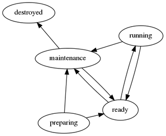

XWorkflows
==========

http://github.com/rbarrois/xworkflows/

http://github.com/rbarrois/django_xworkflows/

----

Objectifs
=========

- Définir des états et transitions
- Valider l'enchaînement des états
- Effectuer des actions lors des transitions
- Décrire lisiblement la logique métier

Exemple :

----

Définir un workflow
===================

.. sourcecode:: python

    class TicketWorkflow(xworkflows.Workflow):
        states = [
            ('new', _(u"New")),
            ('assigned', _(u"Assigned")),
            ('closed', _(u"Closed")),
        ]
        transitions = [
            ('assign', ['new'], 'assigned'),
            ('reject', ['assigned'], 'new'),
            ('reassign', ['assigned'], 'assigned'),
            ('close', ['new', 'assigned'], 'closed'),
        ]
        initial_state = 'new'

    class Ticket(xworkflows.WorkflowEnabled):
        state = TicketWorkflow()

----

Utiliser un workflow
====================

.. sourcecode:: pycon

    >>> ticket = MyTicket()
    >>> ticket.state
    State('new')

    >>> ticket.assign()
    >>> ticket.state
    State('assigned')

    >>> ticket.assign()
    Traceback (most recent call last):
      File "<stdin>", line 1, in <module>
    InvalidTransitionError: Transition "assign" isn't available from state "assigned"

----

Actions
=======

.. sourcecode:: python

    class Ticket(xworkflows.WorkflowEnabled):
        state = TicketWorkflow()

        @transition()
        def assign(self, to):
            self.assignee = to

.. sourcecode:: pycon

    >>> ticket = MyTicket()
    >>> ticket.state
    State('new')

    >>> ticket.assign('ponyconseil')
    >>> ticket.state
    State('assigned')
    >>> ticket.assignee
    'ponyconseil'

----

Fonctions complémentaires
=========================

Pour tester l'état d'un objet
-----------------------------

.. sourcecode:: python

    # short for ticket.state == TicketWorkflow.states.new
    ticket.state.is_new

Si le nom de la transition est déjà utilisé
-------------------------------------------

.. sourcecode:: python

    class SomeObject(xworkflows.WorkflowEnabled):
        @transition('bar')
        def gobar(self, x):
            if x != 42:
                raise xworkflows.AbortTransition()

Introspection
-----------------------

.. sourcecode:: pycon

    >>> ticket.state
    State('assigned')
    >>> ticket.state.transitions
    [Transition('reassign'), Transition('close')]

----

Intégration avec Django
=======================

* Appelle automatiquement ``.save()`` après chaque transition

.. sourcecode:: python

    class MyModel(django_xworkflows.XWorkflowEnabled):
        state = MyWorkflow()

* Crée un ``TransitionLog`` à chaque transition

.. sourcecode:: pycon

    >>> MyModel().gobar(log=True, save=True)    # default options
    >>> django_xworkflows.TransitionLog.objects.all()
    [<TransitionLog(obj, 'gobar')>]

